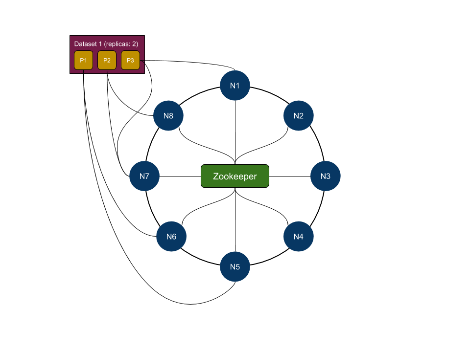

## ⚠️ Archived
Please have a look at [AnnDB](https://github.com/marekgalovic/anndb). AnnDB is a distributed approximate nearest neighbors search database that also supports online data modification.

# TAU
TAU is a distributed approximate nearest neighbors search library written in GO. Data is organized into datasets that are composed of partitions (individual files). Partitions are distributed across nodes in the cluster and can be replicated for speed and availability.

### Index
TAU currently supports these index types:
- **HNSW** constructs a Hierarchical Navigable Small World Graph that separates vertex connections on different layers of the graph. The lower the layer in the graph, the larger average degree a vertex has. Implemented according to [this paper](https://arxiv.org/pdf/1603.09320.pdf).
- **BTree** constructs a binary search tree using random projections. When building the tree, a random pair of points is sampled and a hyperplane equidistant to these points is computed. Samples are then split based on the sign of the distance to the hyperplane. This process continues until the number of candidate samples is less than leaf size threshold.
- **Voronoi** constructs a search tree using K-Means++ algorithm. At each level of the tree, samples are split into k clusters until the number of candidate samples is less than leaf size threshold.

### Cluster
Although it's possible to run TAU on a single machine, TAU can leverage multiple machines to speed up search and dataset index building. Each node is treated equally and there is no concept of a "master". To achieve consensus on which nodes should own what partitions, TAU uses rendezvous (highest random weight) hashing and Zookeeper for node discovery and dataset management.

